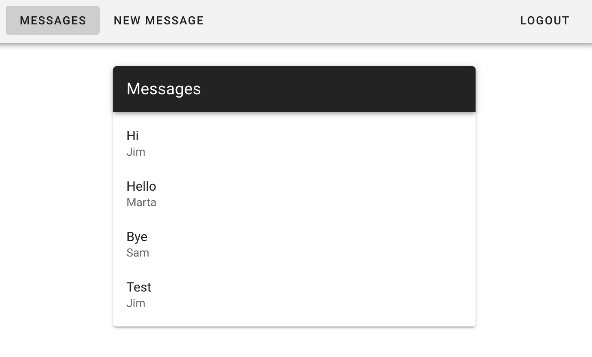

<!-- PROJECT TITLE -->
 

<h2 align="center">Building Vue and Node Apps with Authentication</h3>

 Linkedin course by Alexander Zanfir

 

 

## About the project

I've followed this LinkedIn <a href="https://www.linkedin.com/learning/building-vue-and-node-apps-with-authentication?contextUrn=urn%3Ali%3AlyndaLearningPath%3A5d94ce0a498e93731fbb8711">course</a> offered by Alexander Zanfir.

This course demonstrates how to build an interface in Vue.js that can send information to a Node.js server and adjust to its responses, as well as make sure that only authorized users can visit.

I am on my way to achieve a :rocket: fullstack overview!

 

 

## Built with

Major frameworks/libraries used:

- Vue
- Babel
- Vuetify
- Vuex
- Vue-Router
- Axios
- Express
- Jsonwebtoken

 

## Author

I'm Marta Boteller, little more about me at my [website](https://martaboteller.com).

   

## Acknowledgments

This course was prepared with older versions of Vue and Vuetify. Minor changes have been implemented now.
  I would like to thank <a href="https://www.linkedin.com/learning/building-vue-and-node-apps-with-authentication?contextUrn=urn%3Ali%3AlyndaLearningPath%3A5d94ce0a498e93731fbb8711">Alexander Zanfir </a>for his fantastic way of teaching!

##
